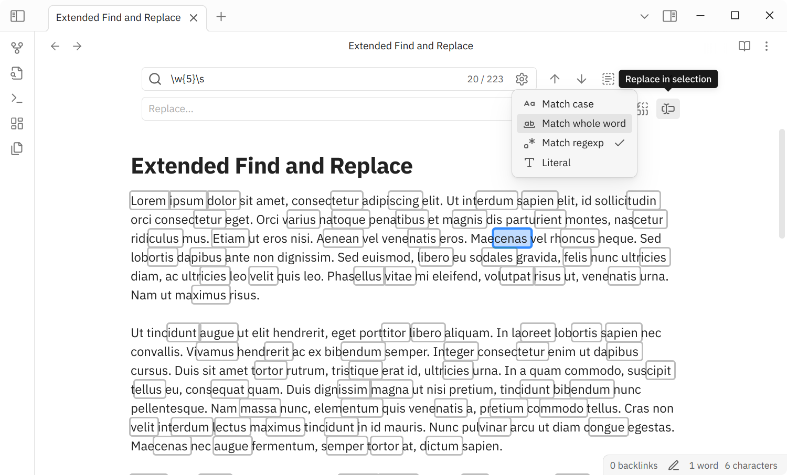

# Extended Find & Replace - Obsidian Plugin

Overhaul editor find-and-replace functionality. Powered by [CodeMirror](https://codemirror.net) search API.

## 🚀 Features

- **Search rules**. Add some basic search rules such as case-sensitive, regexp, etc.
- **Replace in selection**. Replace all the matches that are in the selection range.
- **Native look**. Adapt to the native design guidelines.
- **Keep last input**. Remember the last query you've input.
- **Popover and canvas support**. Support both popover and canvas editor.

## 📦 Installation

- Manual
    - Create a folder named `extended-find-replace` under `YOUR_VAULT_NAME/.obsidian/plugins`.
    - Place `manifest.json`, `main.js`, and `style.css` from the latest release into the folder.
    - Enable it through the "Community plugin" setting tab.
- Using [BRAT](https://github.com/TfTHacker/obsidian42-brat)
    - Install and enable "BRAT" plugin in "Community plugins" list.
    - Choose "BRAT" setting tab.
    - Click "Add beta plugin" under "Beta plugin list" section.
    - Enter this repo link into "Repository" input field.
    - Check "Enable after installing the plugin" and click "Add Plugin".

> [!Note]
>
> Currently, this plugin haven't been released yet.

## ✍️ Usage

### Commands and Keymaps

This plugin provides two commands:
- **Open editor search for current note**: expands search panel without replace field.
- **Open editor search and replace for current note**: expands search panel with replace field shown.

Run those commands manually via command palette prompt, or set specific keymap for each.

Upon expanded search panel, certain keymaps can be used to navigate mathced text (The same behavior as the native one):
- <kbd>F3</kbd>: Advance to the next match (<kbd>Enter</kbd> can be used only when the search field is focused).
- <kbd>Shift</kbd> <kbd>F3</kbd>: Go back to the previous match (<kbd>Shift</kbd> <kbd>Enter</kbd> can be used only when the search field is focused).
- <kbd>Alt</kbd> <kbd>Enter</kbd>: Select all the matches (only when the search field is focused).
- <kbd>Enter</kbd>: Replace current selected match (only when the replace field is focused).
- <kbd>Ctrl</kbd> <kbd>Alt</kbd> <kbd>Enter</kbd>: Replace all the matches (only when the replace field is focused).
- <kbd>Esc</kbd>: Close the panel.

> [!Note]
>
> You can still use native find and replace provided by Obsidian.

### Action Buttons

There are three additional buttons from the default buttons:
- **Open rules** button: located inside the search field. Provides some search rules like match case, regexp, etc...
- **Show/hide replace** button: located beside the search field. Used to expand replace field.
- **Replace in selection** button: located beside the replace field. Will replace all matches that are in the selection range.

### Search Rules

To extend default search behavior, this plugin provides some rule options stricting the match result. Click **Open rules** button to get the list of those options.

- **Match case**: Make it case-sensitive.
- **Match whole word**: Only match the entire word, and that's not a part of a larger word.
- **Match regexp**: Interpret the input query as regexp.
- **Literal**: Treat escape sequences, such as `\n` and `\t`, as literal characters.

When **Match regexp** enabled, substitution tokens (only some of them) can be used as replacement:
- `$$`: insert "$" dollar sign,
- `$&`: insert complete match contents,
- `$n`: where `n` is 1-based number, insert capture group `n` contents.

## ⚙️ Tweaks

In the settings, there are two options available:
- **Shared query**: When enabled, same search query will be shared among all available editors. It keeps the query synchronized even if you move to another note.
- **Remember last query**: Save the last input query and restore it even after closing the app.

## ⚠️ Caveat

Due to performance reason, "Replace all" and "Replace in selection" wouldn't work if the result exceeds 1000 matches.

## 🙏 Acknowledgment

Specially thanks to:
- [CodeMirror](https://github.com/codemirror) and its maintainers, [Marijnh](https://github.com/marijnh) and the others.
